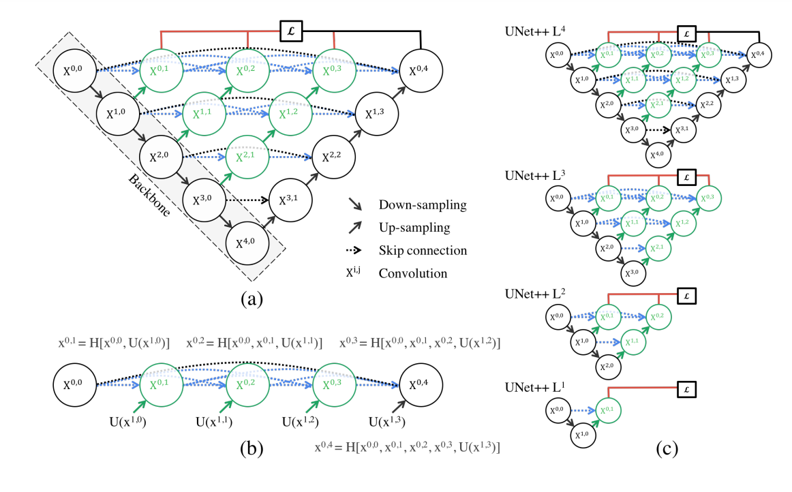

**

 	Comparison of Convolutional Neural Network Architectures for Generating Cloud Masks for Landsat-8 Imagery
**

**
Deep Learning in Python - Final Project Submission
**

Figure 0 - Sample of classification results from Simple Unet on testing imagery

Mitchell Creelman

Graduate Research Assistant

Boise State University - CryoGARS Group

## **Introduction**

This project aims to compare the efficacy of two different U-shaped convolutional neural networks for the production of cloud masks using a set of 95 pre-classified images from the Landsat 8 (USGS, 2013) imaging platform. These images consist of red, blue, green, and near infra-red bands as well as a pre-developed ground-truth cloud mask marking the locations of clouds in each scene (Mohajerani et al., 2018/2019/2020). These images will be used to train two different convolutional network architectures, a simple 2-dimensional Unet architecture (Weng et al., 2015), and a more complex architecture known as Unet ++ (Zhou et al., 2018). These trained networks will then be asked to generate cloud masks for an identical set of testing data in order to determine the relative performance of each design. 

## **Background**

### Imagery Products
Optical remote sensing products consist of multispectral images collected by spaceborn passive sensors which collect rasterized reflectance values ranging from 400 to 13000 nm (Song et al., 2021). Wavelengths are broken down into bandwidths ranging between 15 nm and 590 nm, and are collected at spatial resolutions between 10 $m^2$
 and 1000 $m^2$ (Drusch et al., 2012, Irons et al., 2012). These imagery products are used in a wide variety of scientific and industrial applications, from looking at land use changes and agricultural activity, to observing ocean currents and monitoring environmental change (Song et al., 2021). The temporal resolution of this imagery is dependant on the orbital characteristics of each individual sensor platform and thus tends to range between 3 days and two weeks for most locations around the globe.
 
While the variability between individual sensory platforms creates a wide array of use-cases for these images, it also has some major drawbacks. The lack of consistency in temporal, spectral, and spatial resolution between sensor platforms often means that developing a one-size-fits-all algorithm for optical remote sensing data is particularly challenging (Mateo-Garcia et al., 2020). As such, recent years have seen dramatic developments for the application of image classifications techniques to remote sensing products.

### Cloud Masking Techniques

Given the rise of interest in using optical remote sensing products for a wide variety of private and public applications, classifying and labeling atmospheric cover has become a critically important field of research (Zhu et. al, 2012, López-Puigdollers et al., 2021), as clouds and their shadows are often considered a source of contamination for optical remote sensing data (Ardvision et. al, 2001). This task has traditionally been accomplished one of two ways, through manual delineation of atmospheric phenomena, or using pre-processing algorithms designed specifically for an individual sensor such as Fmask for the Landsat 8 platform (Frantz et. al, 2018), or Sen2Cor for the Sentinel 2 platform (Louis et al., 2021). While highly effective, manual delineation is highly time-intensive and thus not suitable for the production of large scale datasets. The on-board pre-processing algorithms, which can achieve an overall accuracy of 90%, often miss thin clouds and cloud shadows (Frantz et. al, 2018, Louis et al., 2021). Due to these limitations, deep learning and convolutional neural networks have become an increasingly popular strategy to develop masks for clouds and cloud shadows (López-Puigdollers et al., 2021, Wang et. al, 2022)

While there are a wide variety of machine learning and neural network approaches that can be used to classify atmospheric cover, convolutional neural networks in-particular have emerged as one of the most popular and effective strategies (Wang et al, 2022, Zhixiang, et al, 2020, Jiaqiang et al., 2020). This is due to their inherently high-adaptability and the ease with which networks can be re-trained for new applications and imagery (Gonzalo et al., 2020) as well as their efficacy in the field of semantic segmentation (Shelhammer et al., 2017). Semantic segmentation is a field of computer vision which seeks to provide pixel-wise classification of objects, thereby identifying the boundaries of specific objects rather than just identifying their presence in a given area as in more traditional computer vision tasks (Brown, R., 2019). This ability to delineate the predominant shape and reflective properties of cloud cover is what makes CNNs such an ideal tool for automating the development of cloud masks. 

### Specific Architectures

This project seeks to compare two specific Unet architectural designs, that of a simple U shaped network (Figure 1) and that of a Unet++ (Figure 2), a far more complex network using nested and dense skip connections (Adaloglou, 2021)

Figure 1 - Standard Unet Architecture (Adaloglou, 2021)

Figure 2 - Unet++ Architecture (Zhou et al., 2018)

Both of these networks belong to the convolutional neural network family (CNN), a subsection of encoder-decoder classification algorithms used for semantic segmentation tasks in image classification. These networks distill images down to identify the locations of given objects and then expand the images again in order to determine the shape and boundaries of each individual objects. 

The Unet is a symmetrical fully convolutional neural network architecture that is used for semantic segmentation of imagery (Ronneberger et al., 2021). It is composed of two symmetrical sections, one for downsampling, and one for upsampling (Figure 1). The downsampling portion of the network identifies the location of objects within the network, while the upsampling portion of the network works to determine the border of each object within the image. The downsampling portion consists of two 3x3 convolutions, with ReLU activation functions between each layer.  These are then downsampled by a 2x2 max pooling operation with a stride of 2. The number of feature channels is then doubled between each layer.  The up convolutions involve an upsampling of the feature map followed by a 2x2 convolution halving the number of feature channels with a ReLU activation function between each. This is then repeated until a final 1x1 layer is used to map the classes of the image. The depth of this architecture is given by the L rating, which was set to 4 for this experiment. The main advantage of this architecture is its relative simplicity, lending it relative computational efficiency.

The Unet++ Architecture seeks to use nested and dense skip connections in order to design a network that is more effective at identifying fine-grain details of imagery (Zhou et al., 2018). As with the U-net design, this network contains a symmetrical downscaling and upscaling portion of images. However, it uses skip pathways which connect both sides of the network far more intricately than prior neural network designs.  Rather than simply concatenating two layers of mirror network sections, the skip pathways use multiple convolutional layers and concatenation layers to link higher blocks to lower blocks. These stacks are formally computed using equation 1, where H is a convolutional operation followed by an activation function, and U denotes an up-sampling layer. The j and i elements indicate the layer and depth within the network. 

	

	
Equation 1 - computation of skip connections in Unet++ ( Zhou et al., 2018)

By implementing this novel connectivity strategy, the network should provide improved feature extraction over its simpler counterparts. However, this obviously comes at the cost of computational efficiency. 

## **Methods**

The dataset used for this project I was the Cloud 95 Dataset (Mohhajerani & Saeedi, 2021, Mohhajerani & Saeedi, 2019, Mohajerani et al., 2018). This dataset consists of red, green, blue, near infrared (NiR) bands from a set of 95 separate Landsat 8 images, as well as a ground-truth mask of clouds for each. Each of these images was subdivided into 576 separate sub images of 384 x 384 pixels to maximize the amount of training data available. This results in 34,700 overall training images for the network. 

For the data split, a 60/20/20 training/validation/testing split of this data was then used for training, with a consistently seeded random number generator used to prevent the model from seeing the testing data during its training phase. Each of these models was trained on the for 60 epochs using a batch size of 8 on the Borah computer cluster at Boise State University (Trader, 2022). The batch size was set at 8 due to GPU memory limitations. Both networks were trained on the same training and validation datasets through use of a seeded random number generator. They were also tested on the same dataset using the same methods. Both networks were tested with a learning rate of 0.0001 and a confusion matrix of the classification results was generated using pytorch (Paszke et al., 2019) and used for further statistical analysis.

## **Results** 
Overall, there were rather disparate performances between the models. In order to examine the performance and accuracy of these networks two methods were used. The first was an accuracy metric looking at the agreement of the images based on the argmax output of the final product and the ground-truthed mask. This was paired with a cross-entropy metric for loss calculation and the two were used to track the performance and progression of model performance throughout the 60 epoch development phase (Figure 3). The second metric was a confusion matrix generated from the testing results for each model (Table 1). This matrix was then used to calculate a number of analytical statistics used to compare both models (Tables 1, 2).

The accuracy and loss progressions of the two models are strikingly different. While the Unet model started at roughly 80%, it quickly trended up to 96% accuracy by the end of its 60 epoch training period.  Meanwhile, the Unet++ started at 78% in its initial training and steadily went downhill until it eventually crashed to 40% accuracy around epoch 50. Similar, though inverse behavior is seen in the loss functions, where the Unet steadily decreases to 0.1 while the Unet++ stays steady before increasing around epoch 50. It should be noted, however, that the performances on the testing dataset were considerably closer. While the Unet++ network still had a relatively high testing loss (0.48 vs. 1.2), it performed with a testing accuracy of 82.31% versus the Unet’s 97.09%. However, this top line accuracy may be misleading, as the confusion matrix statistics show a more nuanced story. 

The confusion matrix is a statistical tool in remote sensing used to analyze the pixel-by-pixel performance of classification algorithms (Campbell & Wynne, 2016). The confusion matrix results show a far different story than the overall accuracy. The confusion matrix accuracy comes in at 63.8% for Unet++, and 69.2% for the Unet. While the 5.4% difference is certainly significant, neither of these is as high-performing as the top-line numbers would suggest. The balanced accuracy of 83% and 92.4% respectively, however, are much closer to the top line numbers. The simpler network also performed better in identifying clear pixels, with a true negativity rate of 87.1% against the more complex networks 71%. This was also seen in the false omission rates, with Unet having a low of 4.8% and Unet++ have a higher 11.8% rate. The simpler network also showed a greater threat score (Tables 1, 2) with a score of 91.1% against the more complex network’s 81.8%. These performance differences can also be seen in the outputs of the individual networks (Figure 0, 4) The traditional Unet (Figure 0), while not correctly identifying every pixel, produced a relatively representative predicted mask when compared to the ground truthing of the sample. The Unet++ (Figure 4) network was rife with incorrectly inserted cloud cover as well as failing to produce clouds where the ground truth showed significant cover. 

## **Discussion**

### Results

Overall, these results seem to make a good argument for the strengths of computational efficiency and simplicity in the approach to complex classification problems. While both algorithms performed at comparable levels as measured by the overall accuracies, the added complexity of the Unet++ model both produced consistently inferior results and took significantly longer to train. The simpler Unet model can thus be said to be a superior and cheaper product from a computational cost standpoint. This would explain the popularity of lightweight UNets in the current literature and their widespread application for remote sensing segmentation tasks.

It also seems as though the accuracy metrics could have used more attention. The accuracy metrics of the testing and training phases were taken from classification algorithms that were not concerned with pixel-by-pixel performance. As such, I believe that moving away from an argmax framework and applying a more appropriate confusion matrix format to the accuracy assessment for image segmentation tasks would be more appropriate. However, as it stands, I do not currently know how to do this and so it will have to remain an item for later development. Additionally, I would like to get the distribution of confusion matrix statistics for each analyzed image instead of simply using the overall numbers. This would give a valuable image-by-image distribution for metrics such as prevalence. 

### Limitations 

It should be noted, however, that this study had significant limitations, many of which simply centered around the time allotted. The complexity of the Unet++ model meant that there were a number of tunable parameters and it had a high sensitivity and often the effects of the parameters would not become apparent until 40/60 epochs. This paired with the fact that a full training of the Unet++ took roughly 17 hours per attempt meant that the hyper parameters may have never reached an optimal tuning. This may account for the relatively flat accuracy throughout the training cycle as well as the frequent false positives and false negatives produced by the Unet++ network (Figure 3,4). 

Additionally, better use could have been made of the initial training data. While there were 21,000 images available for training, these could have been further augmented to increase the performance of our network. Due to the fact that this dataset is composed of reflectance values, augmentations such as noise and normalization would not have been appropriate, as these may have some unwanted influence on the algorithms effectiveness in analyzing spectral composition of the images. However, given that the network is not considering metadata such as the physical or temporal location of images, techniques such as rotation and affine transformations of the data would have allowed further leveraging of the existing dataset. This was not implemented due to the time restraints as most pytorch image tools are meant for 3 band images (R/G/B) and our dataset consisted of 4 band imagery. 

### Next Steps

There are three logical progressions for this study: 1) The implementation of augmentation for imagery, as previously stated. 2) The further examination of network design for semantic segmentation tasks. 3) the inclusion of more spectral data and metadata for each image. The case for implementations of augmented imagery was made previously in this report. As to network designs, there are quite a few such as ResUnet (Diakogiannis et al., 2020), Unet Lite ( Libin & Gao, 2022), and Vnet (Milletari et al., 2016). The varying depth and complexity of these designs would give more insight as to the question of tradeoffs between modeling complexity and computational efficiency in remote sensing applications. The final point of implementing more bands and imagery is probably the most complex of the tasks. This either involves working with the author of the initial dataset and using their processing scripts in order to develop samples for all 12 bands of all 95 images. This would then be compounded by creating rasterized datasets of metadata such as sun angle and equatorial position. While challenging, such efforts would surely be worthwhile as there is a plethora of data that is not considered when simply using the 4 bands that we chose. Overall, there is certainly room for growth for atmospheric sciences in the field of deep learning and remote sensing.

## **Figures and Tables**

Figure 3 - Comparison graph of loss and accuracy performance between networks

	
	
	

Figure 4 - Visualization of Testing performance by Unet++ Network. Note the frequent false negatives and false positives in lines 2 and 3

Table 1 - Confusion matrix statistics from each network. 

<table>
  <tr>
   <td><strong>Statistics</strong>
   </td>
   <td><strong>Unet++</strong>
   </td>
   <td><strong>Unet</strong>
   </td>
   <td><strong>Unet-Unet++</strong>
   </td>
  </tr>
  <tr>
   <td>Testing Accuracy
   </td>
   <td>82.31
   </td>
   <td>97.09
   </td>
   <td>14.78
   </td>
  </tr>
  <tr>
   <td>Testing Loss
   </td>
   <td>0.48
   </td>
   <td>0.112
   </td>
   <td>-0.368
   </td>
  </tr>
  <tr>
   <td>True Positive (TP)
   </td>
   <td>2166535
   </td>
   <td>13889639
   </td>
   <td>11723104
   </td>
  </tr>
  <tr>
   <td>False Negative (FN)
   </td>
   <td>118878
   </td>
   <td>348060
   </td>
   <td>229182
   </td>
  </tr>
  <tr>
   <td>False Positive (FP)
   </td>
   <td>363524
   </td>
   <td>1013039
   </td>
   <td>649515
   </td>
  </tr>
  <tr>
   <td>True Negative (TN)
   </td>
   <td>890007
   </td>
   <td>6867662
   </td>
   <td>5977655
   </td>
  </tr>
  <tr>
   <td>Positive (P)
   </td>
   <td>2285413
   </td>
   <td>14237699
   </td>
   <td>11952286
   </td>
  </tr>
  <tr>
   <td>Negative (N)
   </td>
   <td>1253531
   </td>
   <td>7880701
   </td>
   <td>6627170
   </td>
  </tr>
  <tr>
   <td>Predicted Positive (PP)
   </td>
   <td>2530059
   </td>
   <td>14902678
   </td>
   <td>12372619
   </td>
  </tr>
  <tr>
   <td>Predicted Negative (PN)
   </td>
   <td>1008885
   </td>
   <td>7215722
   </td>
   <td>6206837
   </td>
  </tr>
  <tr>
   <td>Total Population (T)
   </td>
   <td>3538944
   </td>
   <td>22118400
   </td>
   <td>18579456
   </td>
  </tr>
  <tr>
   <td>True Positivity Rate (TPR)
   </td>
   <td>0.948
   </td>
   <td>0.976
   </td>
   <td>0.028
   </td>
  </tr>
  <tr>
   <td>False Negativity Rate (FNR)
   </td>
   <td>0.052
   </td>
   <td>0.024
   </td>
   <td>-0.028
   </td>
  </tr>
  <tr>
   <td>False Positivity Rate (FPR)
   </td>
   <td>0.29
   </td>
   <td>0.129
   </td>
   <td>-0.161
   </td>
  </tr>
  <tr>
   <td>True Negative Rate (TNR)
   </td>
   <td>0.71
   </td>
   <td>0.871
   </td>
   <td>0.161
   </td>
  </tr>
  <tr>
   <td>Prevalence (Prev)
   </td>
   <td>0.646
   </td>
   <td>0.644
   </td>
   <td>-0.002
   </td>
  </tr>
  <tr>
   <td>Accuracy (ACC)
   </td>
   <td>0.638
   </td>
   <td>0.692
   </td>
   <td>0.054
   </td>
  </tr>
  <tr>
   <td>Balanced Accuracy (BA)
   </td>
   <td>0.83
   </td>
   <td>0.924
   </td>
   <td>0.094
   </td>
  </tr>
  <tr>
   <td>Positive Predictive Value (PPV)
   </td>
   <td>0.856
   </td>
   <td>0.932
   </td>
   <td>0.076
   </td>
  </tr>
  <tr>
   <td>False Discovery Rate (FDR)
   </td>
   <td>0.144
   </td>
   <td>0.068
   </td>
   <td>-0.076
   </td>
  </tr>
  <tr>
   <td>False Omission Rate (FOR)
   </td>
   <td>0.118
   </td>
   <td>0.048
   </td>
   <td>-0.07
   </td>
  </tr>
  <tr>
   <td>Negative Positivity Rate (NPV)
   </td>
   <td>0.882
   </td>
   <td>0.952
   </td>
   <td>0.07
   </td>
  </tr>
  <tr>
   <td>Positive Likelihood Ratio (LRP)
   </td>
   <td>3.269
   </td>
   <td>7.589
   </td>
   <td>4.32
   </td>
  </tr>
  <tr>
   <td>Negative Likelihood Ratio (LRN)
   </td>
   <td>0.073
   </td>
   <td>0.028
   </td>
   <td>-0.045
   </td>
  </tr>
  <tr>
   <td>Threat Score (TS)
   </td>
   <td>0.818
   </td>
   <td>0.911
   </td>
   <td>0.093
   </td>
  </tr>
</table>

Table 2 - Definitions and equations of statistical terms

<table>
  <tr>
   <td><strong>Statistics</strong>
   </td>
   <td><strong>Description</strong>
   </td>
   <td><strong>Equation</strong>
   </td>
  </tr>
  <tr>
   <td>Testing Accuracy
   </td>
   <td>accuracy given by the testing loop
   </td>
   <td>
   </td>
  </tr>
  <tr>
   <td>Testing Loss
   </td>
   <td>loss given by the testing loop
   </td>
   <td>
   </td>
  </tr>
  <tr>
   <td>True Positive (TP)
   </td>
   <td>number of pixels correctly identified as positive
   </td>
   <td>
   </td>
  </tr>
  <tr>
   <td>False Negative (FN)
   </td>
   <td>number of pixels incorrectly identified as negative
   </td>
   <td>
   </td>
  </tr>
  <tr>
   <td>False Positive (FP)
   </td>
   <td>number of pixels incorrectly identified as positive
   </td>
   <td>
   </td>
  </tr>
  <tr>
   <td>True Negative (TN)
   </td>
   <td>number of pixels correctly identified as negative
   </td>
   <td>
   </td>
  </tr>
  <tr>
   <td>Positive (P)
   </td>
   <td>number of pixels identified as positive
   </td>
   <td>
   </td>
  </tr>
  <tr>
   <td>Negative (N)
   </td>
   <td>number of pixels identified as negative
   </td>
   <td>
   </td>
  </tr>
  <tr>
   <td>Predicted Positive (PP)
   </td>
   <td>total number of pixels labeled positive
   </td>
   <td>
   </td>
  </tr>
  <tr>
   <td>Predicted Negative (PN)
   </td>
   <td>total number of pixels labeled negative
   </td>
   <td>
   </td>
  </tr>
  <tr>
   <td>Total Population (T)
   </td>
   <td>total number of pixels labeled
   </td>
   <td>
   </td>
  </tr>
  <tr>
   <td>True Positivity Rate (TPR)
   </td>
   <td>Likelihood a pixel is correctly labeled positive
   </td>
   <td>TP/P
   </td>
  </tr>
  <tr>
   <td>False Negative Rate (FNR)
   </td>
   <td>Likelihood a pixel is incorrectly labeled negative
   </td>
   <td>FN/P
   </td>
  </tr>
  <tr>
   <td>False Positivity Rate (FPR)
   </td>
   <td>Likelihood a pixel is incorrectly labeled positive
   </td>
   <td>FP/N
   </td>
  </tr>
  <tr>
   <td>True Negative Rate (TNR)
   </td>
   <td>Likelihood a pixel is correctly labeled negative
   </td>
   <td>TN/N
   </td>
  </tr>
  <tr>
   <td>Prevalence (Prev)
   </td>
   <td>Rate of positivity among all pixels
   </td>
   <td>P/(P+N)
   </td>
  </tr>
  <tr>
   <td>Accuracy (ACC)
   </td>
   <td>Overall Accuracy of the model
   </td>
   <td>(TP+TN)/(P+N)
   </td>
  </tr>
  <tr>
   <td>Balanced Accuracy (BA)
   </td>
   <td>Median of true positivity and true negativity rates
   </td>
   <td>(TPR+TNR)/2
   </td>
  </tr>
  <tr>
   <td>Positive Predictive Value (PPV)
   </td>
   <td>Percentage of positive pixels that are correctly positive
   </td>
   <td>TP/(TP+FP)
   </td>
  </tr>
  <tr>
   <td>False Discovery Rate (FDR)
   </td>
   <td>Percentage of positive results falsely labeled positive
   </td>
   <td>FP/(FP+TP)
   </td>
  </tr>
  <tr>
   <td>False Omission Rate (FOR)
   </td>
   <td>Percentage of negative results falsely labeled negative
   </td>
   <td>FN/(FN+TN)
   </td>
  </tr>
  <tr>
   <td>Negative Positivity Rate (NPV)
   </td>
   <td>Percentage of positive pixels that are correctly negative
   </td>
   <td>TN/(TN+FN)
   </td>
  </tr>
  <tr>
   <td>Positive Likelihood Ratio (LRP)
   </td>
   <td>Ratio of true positives to false positives
   </td>
   <td>TPR/FPR
   </td>
  </tr>
  <tr>
   <td>Negative Likelihood Ratio (LRN)
   </td>
   <td>Ratio of true negatives to false negatives
   </td>
   <td>TPN/FPN
   </td>
  </tr>
  <tr>
   <td>Threat Score (TS)
   </td>
   <td>Amount of overlap within identified areas
   </td>
   <td>TP/TP + FN + FP
   </td>
  </tr>
</table>

## **Citations**

* Adaloglou, N. (2021, April 15). An overview of unet architectures for semantic segmentation and biomedical image segmentation. AI Summer. Retrieved December 13, 2022, from [https://theaisummer.com/unet-architectures/#:~:text=Unet%20is%20also%20a%20symmetric%20architecture%2C%20as%20depicted%20below.&text=It%20can%20be%20divided%20into,a%20ReLU%20and%20batch%20normalization](https://theaisummer.com/unet-architectures/#:~:text=Unet%20is%20also%20a%20symmetric%20architecture%2C%20as%20depicted%20below.&text=It%20can%20be%20divided%20into,a%20ReLU%20and%20batch%20normalization)    

* Arvidson, T., Gasch, J., & Goward, S. N. (2001). Landsat-7's long-term acquisition plan — An innovative approach to building a global imagery archive. Remote Sensing of Environment, 78(1–2), 13–26

* Brown, R. (2019, November 28). What is the difference between image segmentation and classification in image processing? Medium. Retrieved December 13, 2022, from [https://medium.com/cogitotech/what-is-the-difference-between-image-segmentation-and-classification-in-image-processing-303d1f660626](https://medium.com/cogitotech/what-is-the-difference-between-image-segmentation-and-classification-in-image-processing-303d1f660626)

* Campbell, J. B., & Wynne, R. H. (2011). _Introduction to remote sensing_. Guilford Press.

* Cresson Rémi. (2022). _Deep learning for remote sensing images with open source software_. CRC Press. 

* Diakogiannis, F. I., Waldner, F., Caccetta, P., &amp; Wu, C. (2020). ResUNet-A: A deep learning framework for semantic segmentation of remotely sensed data. ISPRS Journal of Photogrammetry and Remote Sensing, 162, 94–114. https://doi.org/10.1016/j.isprsjprs.2020.01.013 

* Drusch, M., Del Bello, U., Carlier, S., Colin, O., Fernandez, V., Gascon, F., Hoersch, B., Isola, C., Laberinti, P., Martimort, P., Meygret, A., Spoto, F., Sy, O., Marchese, F., & Bargellini, P. (2012). Sentinel-2: ESA’s Optical High-Resolution Mission for GMES Operational Services. Remote Sensing of Environment, 120, 25–36. https://doi.org/10.1016/j.rse.2011.11.026

* Frantz, D., Haß, E., Uhl, A., Stoffels, J., & Hill, J. (2018). Improvement of the Fmask algorithm for Sentinel-2 images: Separating clouds from bright surfaces based on parallax effects. In Remote Sensing of Environment (Vol. 215, pp. 471–481). [https://doi.org/10.1016/j.rse.2018.04.046](https://doi.org/10.1016/j.rse.2018.04.046)

* Irons, J. R., Dwyer, J. L., & Barsi, J. A. (2012). The next Landsat satellite: The Landsat Data Continuity Mission. Remote Sensing of Environment, 122, 11–21. https://doi.org/10.1016/j.rse.2011.08.026

* Mateo-García, G., Laparra, V., López-Puigdollers, D., & Gómez-Chova, L. (2020). Transferring deep learning models for cloud detection between Landsat-8 and Proba-V. ISPRS Journal of Photogrammetry and Remote Sensing, 160(December 2019), 1–17. [https://doi.org/10.1016/j.isprsjprs.2019.11.024](https://doi.org/10.1016/j.isprsjprs.2019.11.024)

* Harris, C.R., Millman, K.J., van der Walt, S.J. et al. Array programming with NumPy. Nature 585, 357–362 (2020). DOI: 10.1038/s41586-020-2649-2 

* Jiao, L., &amp; Gao, W. (2022). Refined UNET Lite: End-to-end lightweight network for edge-precise cloud detection. Procedia Computer Science, 202, 9–14. https://doi.org/10.1016/j.procs.2022.04.002 

* López-Puigdollers, D., Mateo-García, G., & Gómez-Chova, L. (2021). Benchmarking deep learning models for cloud detection in landsat-8 and sentinel-2 images. Remote Sensing, 13(5), 1–20. https://doi.org/10.3390/rs13050992

* Louis, J., Pflug, B., Debaecker, V., Mueller-Wilm, U., Iannone, R. Q., Boccia, V., & Gascon, F. (2021). Evolutions of Sentinel-2 Level-2a Cloud Masking Algorithm Sen2Cor Prototype First Results. International Geoscience and Remote Sensing Symposium (IGARSS), 2021-July(1), 3041–3044. [https://doi.org/10.1109/IGARSS47720.2021.9553445](https://doi.org/10.1109/IGARSS47720.2021.9553445)

* Milletari, F., Navab, N., &amp; Ahmadi, S.-A. (2016). V-net: Fully convolutional neural networks for volumetric medical image segmentation. 2016 Fourth International Conference on 3D Vision (3DV). https://doi.org/10.1109/3dv.2016.79  

* Mohajerani, S., Krammer, T. A., & Saeedi, P. (2018). A cloud detection algorithm for remote sensing images using fully convolutional neural networks. 2018 IEEE 20th International Workshop on Multimedia Signal Processing (MMSP). https://doi.org/10.1109/mmsp.2018.8547095 

* Mohajerani, S., &amp; Saeedi, P. (2019). Cloud-net: An end-to-end cloud detection algorithm for Landsat 8 imagery. IGARSS 2019 - 2019 IEEE International Geoscience and Remote Sensing Symposium. https://doi.org/10.1109/igarss.2019.8898776 

* Mohajerani, S., & Saeedi, P. (2021). Cloud and cloud shadow segmentation for remote sensing imagery via filtered Jaccard loss function and parametric augmentation. IEEE Journal of Selected Topics in Applied Earth Observations and Remote Sensing, 14, 4254–4266. https://doi.org/10.1109/jstars.2021.3070786 

* Paszke, A., Gross, S., Massa, F., Lerer, A., Bradbury, J., Chanan, G., … Chintala, S. (2019). PyTorch: An Imperative Style, High-Performance Deep Learning Library. In Advances in Neural Information Processing Systems 32 (pp. 8024–8035). Curran Associates, Inc. Retrieved from [http://papers.neurips.cc/paper/9015-pytorch-an-imperative-style-high-performance-deep-learning-library.pdf](http://papers.neurips.cc/paper/9015-pytorch-an-imperative-style-high-performance-deep-learning-library.pdf)

* Polavr. (2020, July 31). Deteccion_de_nubes_cloud95. Kaggle. Retrieved December 15, 2022, from https://www.kaggle.com/code/polavr/deteccion-de-nubes-cloud95/comments 

* Restlessronin. (2022, December 14). Cloud95 - FASTAI with fastgs multispectral support. Kaggle. Retrieved December 15, 2022, from https://www.kaggle.com/code/restlessronin/cloud95-fastai-with-fastgs-multispectral-support 

* Shelhamer, E., Long, J., & Darrell, T. (2017). Fully Convolutional Networks for Semantic Segmentation. IEEE Transactions on Pattern Analysis and Machine Intelligence, 39(4), 640–651. [https://doi.org/10.1109/TPAMI.2016.2572683](https://doi.org/10.1109/TPAMI.2016.2572683) 

* Song, X.-P., Huang, W., Hansen, M. C., & Potapov, P. (2021). An evaluation of Landsat, Sentinel-2, Sentinel-1 and MODIS data for crop type mapping. Science of Remote Sensing, 3(January), 100018. [https://doi.org/10.1016/j.srs.2021.100018](https://doi.org/10.1016/j.srs.2021.100018) 

* Trader, T. (2022, February 28). Industry compute cluster enables innovative research and development for Health and Life Sciences. HPCwire. Retrieved December 13, 2022, from https://www.hpcwire.com/2022/02/28/industry-compute-cluster-enables-innovative-research-and-development-for-health-and-life-sciences/  

* United States Geological Survey. (2013). _What are the band designations for the Landsat Satellites?_ What are the band designations for the Landsat satellites? | U.S. Geological Survey. Retrieved December 12, 2022, from [https://www.usgs.gov/faqs/what-are-band-designations-landsat-satellites#publications](https://www.usgs.gov/faqs/what-are-band-designations-landsat-satellites#publications)  

* Wang, Y., Albrecht, C., Ait Ali Braham, N., Mou, L., & Zhu, X. (2022). Self-Supervised Learning in Remote Sensing: A Review. IEEE Geoscience and Remote Sensing Magazine. [https://doi.org/10.1109/MGRS.2022.3198244](https://doi.org/10.1109/MGRS.2022.3198244)

* Weng, W., & Zhu, X. (2015). INet: Convolutional Networks for Biomedical Image Segmentation. IEEE Access, 9, 16591–16603. [https://doi.org/10.1109/ACCESS.2021.3053408](https://doi.org/10.1109/ACCESS.2021.3053408)

* Yin, Z., Ling, F., Foody, G. M., Li, X., & Du, Y. (2020). Cloud detection in Landsat-8 imagery in Google Earth Engine based on a deep convolutional neural network Cloud detection in Landsat-8 imagery in Google Earth Engine based on a deep convolutional neural network.

* Zhang, J., Li, X., Li, L., Sun, P., Su, X., Hu, T., & Chen, F. (2020). Lightweight U-Net for cloud detection of visible and thermal infrared remote sensing images. Optical and Quantum Electronics, 52(9), 1–14. https://doi.org/10.1007/s11082-020-02500-8 

* Zhou, Z., Rahman Siddiquee, M. M., Tajbakhsh, N., & Liang, J. (2018). Unet++: A nested u-net architecture for medical image segmentation. Lecture Notes in Computer Science (Including Subseries Lecture Notes in Artificial Intelligence and Lecture Notes in Bioinformatics), 11045 LNCS, 3–11. [https://doi.org/10.1007/978-3-030-00889-5_1](https://doi.org/10.1007/978-3-030-00889-5_1)

* Zhu, Z., & Woodcock, C. E. (2012). Object-based cloud and cloud shadow detection in Landsat imagery. Remote Sensing of Environment, 118, 83–94. https://doi.org/10.1016/j.rse.2011.10.028
